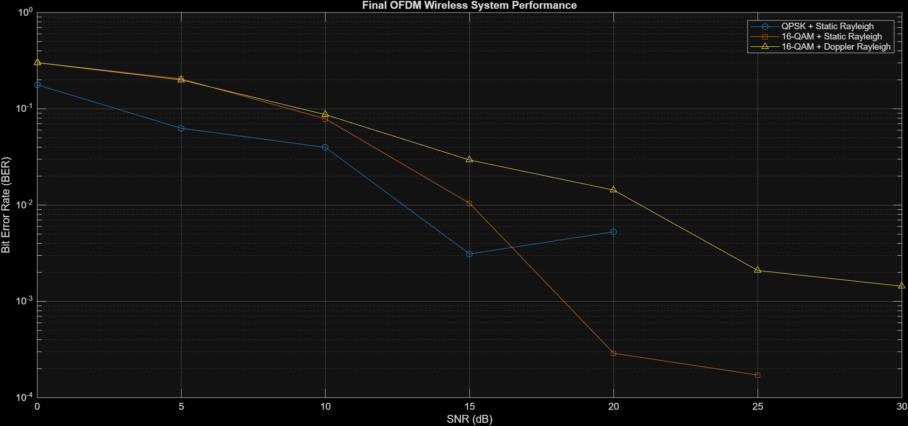

# OFDM-Based Wireless Communication System

## Overview

This project implements a MATLAB-based OFDM wireless communication system to analyze the performance of QPSK and 16-QAM modulation under different wireless channel conditions.

The system evaluates Bit Error Rate (BER) versus Signal-to-Noise Ratio (SNR) for AWGN, Rayleigh fading, and Doppler Rayleigh fading channels.

## Objectives

- Implement an OFDM-based wireless communication system in MATLAB
- Analyze QPSK and 16-QAM modulation
- Study the effect of Rayleigh fading on signal performance
- Study the effect of Doppler fading in time-varying channels
- Apply frequency-domain channel equalization
- Compare BER performance for different modulation and channel conditions

## System Flow

Random Bits  
↓  
QPSK / 16-QAM Modulation  
↓  
OFDM Modulation (IFFT)  
↓  
Cyclic Prefix Insertion  
↓  
Wireless Channel  
↓  
Cyclic Prefix Removal  
↓  
OFDM Demodulation (FFT)  
↓  
Channel Response Estimation  
↓  
Frequency-Domain Equalization  
↓  
Demodulation  
↓  
BER Calculation

## Technologies Used

- MATLAB
- OFDM
- QPSK
- 16-QAM
- AWGN Channel
- Rayleigh Fading
- Doppler Fading
- Channel Equalization
- BER Analysis

## Parameters

| Parameter | Value |
|---|---|
| FFT Size | 64 |
| Cyclic Prefix Length | 16 |
| SNR Range | 0–30 dB |
| SNR Step | 5 dB |
| Simulation Frames | 500 |
| Rayleigh Paths | 2 |
| Doppler Shift | 100 Hz |

## Results

The project compares:

- QPSK over static two-path Rayleigh fading
- 16-QAM over AWGN
- 16-QAM over static two-path Rayleigh fading
- 16-QAM over Doppler Rayleigh fading

The final BER performance comparison is shown below.

## Conclusion

The simulation demonstrates how modulation order and wireless channel conditions affect communication reliability.

QPSK generally provides better BER performance than 16-QAM under fading conditions, while 16-QAM provides higher data-carrying capability at the cost of increased sensitivity to channel impairments.

This project provides a physical-layer foundation for further study of 5G NR wireless communication systems.

## Author

**Swetha R**

ECE Student | Aspiring 5G Engineer
